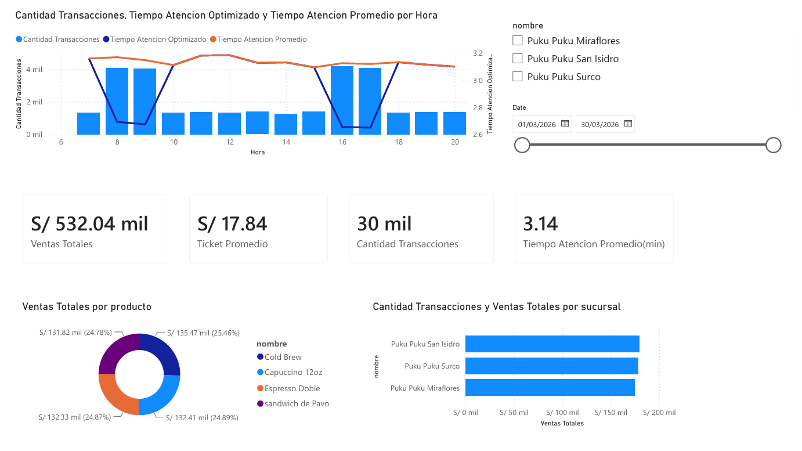

# Puku Puku Analytics: Simulación Estocástica y Optimización Operativa




## Descripción General

Este proyecto combina **Ingeniería de Datos**, **Simulación Probabilística** y **Business Intelligence** para resolver un problema crítico en la gestión operativa de cafeterías de alta demanda: la saturación de colas en horas punta y la optimización del tiempo de atención del personal.

A través de un motor sintético desarrollado en Python, se replicó la llegada estocástica de clientes y el gasto diario en **Puku Puku Café**, para luego construir un modelo relacional y un dashboard interactivo en **Power BI** enfocado en la simulación de escenarios directivos (*What-If*).

---

## Problema de Negocio

En el sector de especialidad de café, la afluencia de clientes no es uniforme. La formación de cuellos de botella entre las **8:00–9:00 AM** y las **4:00–5:00 PM** genera:
* Tiempos de espera elevados que reducen la satisfacción del cliente.
* Riesgo de pérdida de ventas por abandono de cola.
* Ineficiencia en la asignación del personal operativo si se contrata personal fijo adicional sin justificación para todo el turno.

**Objetivo:** Identificar patrones horarios de demanda mediante simulación estocástica y modelar una estrategia de redistribución dinámica de personal de apoyo hacia las cajas en horas pico, evaluando la reducción del tiempo de atención sin elevar los costos fijos.

---

## Arquitectura de la Solución

```text
[ 1. Motor en Python ]  ──>  [ 2. Modelo Relacional (Power BI) ]  ──>  [ 3. Dashboard Interactivo ]
 - Proceso de Poisson         - Esquema en Estrella (Star Schema)      - KPIs Operativos / Financieros
 - Distribución Log-Normal    - Tabla Calendario DAX                   - Escenario "What-If" por Hora
 - Exportación CSV            - Medidas & Métricas DAX                - Segmentadores Dinámicos
